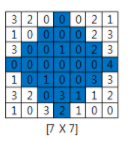

TIL0210

## 1. 오늘 배운것

### 알고리즘

1. for, else 문
   - else는 if 와 같이쓰는 것으로 알고있지만 for와도 함께 쓰일 수 있다.
   - 중간에 break 등으로 끊기지 않고, 끝까지 수행 되었을 때 수행하는 코드이다

``````python
data = [2, 4, 5, 11, 3]
test = 0
for i in data:
    if i > 10:
        test = 1
        break
        
if(test == 0):
    print('10 보다 큰 수 없음')
``````

위와 같은 문장을 for else문으로 쓰면 아래와 같이 쓸 수 있다.

``````python
data = [2, 4, 5, 11, 3]
for i in data:
    if i > 10:
        break
else:
    print('10 보다 큰 수 없음')
``````

잘 이용한다면 가독성도 더 좋고 효율적으로 쓸 수 있다.


알고리즘 하루 한 문제

## 2. 문제 풀이

N개의 2차원 배열로 이루어진 밭에 농작물이 있다. 농작물을 수확하는데 모서리부분은 수확에서 제외한다고 할때,(그림과 같이) 총 수확량을 구해라.



``````python
# 테스트케이스 입력
T = int(input())
for tc in range(1, T+1):
    # 배열 N 입력받는다.
    N = int(input())
    # 농작물 상태를 2차원 배열로 만든다.
    arr = [list(map(int, input())) for v in range(N)]
    # 수확량 설정
    cnt = 0
    # 밭의 위에서 중간(가로가 제일 긴 부분)까지 골라서 더해준다.
    for j in range(N//2+1):
        for k in range(N//2-j, N//2+1+j):
            cnt += arr[j][k]
    # 밭의 아래서 중간아래까지 골라서 더해준다.
    for j in range(1, N//2+1):
        for k in range(N//2 -j+1, N//2 + j):
            # (-)로 아래서 위로 올라가게 해준다.
            cnt += arr[-j][k]
    print('#{} {}'.format(tc, cnt))
``````

2차원 배열에 대하여 풀어보았는데, 슬라이싱하여 풀어보는 방법도 알아보았다. 정말 알고리즘은 배울수록 다양하게 풀 수 있다는 걸 느꼈다.