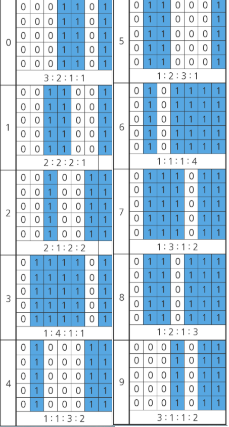

TIL0412

## 1. 오늘 배운것

### 알고리즘


알고리즘 하루 한 문제

## 2. 문제 풀이

SWEA(1240) 단순 2진 암호 코드

어떤 국가에서는 자국 내 방송국에서 스파이가 활동하는 사실을 알아냈다. 스파이는 영상물에 암호 코드를 삽입하여 송출하고 있었다. 암호 코드는 국가 내 중요 시설을 의미하는 숫자임을 알아냈다. 암호 코드의 규칙은 아래와 같다.
 

1. 총 8개의 숫자로 이루어져 있다. 
2. 앞 7자리는 상품 고유의 번호를 나타내며, 마지막 자리는 검증 코드를 나타낸다.

- 검증코드는 아래와 같은 방법으로 계산한다.
  - “(홀수 자리의 합 x 3) + 짝수 자리의 합 + 검증 코드” 가 10의 배수가 되어야 한다.
  - 상품 고유의 번호가 8801234일 경우,
  - “( ( 8 + 0 + 2 + 4 ) x 3 ) + ( 8 + 1 + 3 ) + 검증 코드”
  - = “42 + 12 + 검증 코드”
  - = “54 + 검증 코드” 가 10 의 배수가 되어야 하므로, 검증코드는 6이 되어야 한다.

즉, 88012346 이 정상적인 암호코드고, 그 외의 검증코드가 포함된 경우 비정상적인 암호코드다.

A 업체에서는 이 암호코드들을 빠르고 정확하게 인식할 수 있는 스캐너를 개발하려고 한다. 스캐너의 성능은 아래와 같은 방법으로 측정된다.
 

1. 세로 50. 가로 100 이하의 크기를 가진 직사각형 배열에 암호코드 정보가 포함되어 전달된다. 이 때, 하나의 배열에는 1개의 암호코드가 존재한다. (단, 모든 암호코드가 정상적인 암호코드임을 보장할 수 없다. 비정상적인 암호코드가 포함될 수 있다.)
2. 배열은 1, 0으로 이루어져 있으며 그 안에 포함되어 있는 암호코드 정보를 확인한다.
3. 포함된 암호코드들의 검증코드를 확인하여 정상적인 암호코드인지 확인한다.
4. 정상적인 암호코드들을 판별한 뒤 이 암호코드들에 적혀있는 숫자들의 합을 출력한다.
5. 이때, 총 소요시간이 적을수록 성능이 좋은 것으로 간주된다.


배열에 포함되어 있는 암호코드의 세부 규칙은 아래와 같다.
 

1. 암호코드 하나는 숫자 8개로 구성되며 시작 구분선, 종료 구분선은 별도로 존재하지 않는다.
2. 암호코드가 일부만 표시된 경우는 없다. 모든 암호코드는 8개의 숫자로 구성되어 있다.
3. 암호코드의 세로 길이는 5 ~ 50 칸이다.
4. 암호코드의 가로 길이는 총 길이는 56칸이다. 암호코드에 구성하는 숫자 하나가 차지하는 길이는 7칸이다.

각 숫자들을 그림으로 표시하는 방법은 다음과 같다.



암호코드 정보가 포함된 2차원 배열을 입력으로 받아 정상적인 암호코드를 판별하는 프로그램을 작성하라.

검증코드가 맞으면 합, 틀렸으면 0을 출력해라.

``````python
T = int(input())
for tc in range(1, T+1):
    # 암호코드의 세로길이 N, 가로길이 M 입력
    N, M = map(int, input().split())
    # 0과 1로 이루어진 암호코드 2차원 배열로 입력
    arr = [list(input()) for _ in range(N)]
    # 암호 해독문을 딕셔너리로 저장
    dic = {'0001101': 0, '0011001': 1, '0010011': 2, '0111101': 3, '0100011': 4, '0110001': 5, '0101111': 6, '0111011': 7, '0110111': 8, '0001011': 9}
    for i in range(N):
        for j in range(-1, -M+55, -1):
            # 끝자리가 다 1이므로 뒤에서부터 찾는다. 1을 찾으면 인덱스 x, y로 저장 후 종료
            if arr[i][j] == '1':
                x, y = i, j
                break
    # 암호가 정상적인지 판단할 cal 변수와 다 더한 수 cnt 변수 생성
    cal, cnt = 0, 0
    # 숫자의 암호코드는 총 8자리이므로 8번 반복
    for i in range(8):
        res = ''
        for j in range(7):
            # 암호코드는 한 숫자가 7자리이므로 7번 반복하여 더해준다.
            res += arr[x][y-55+7*i+j]
        # 코드의 홀수 자리는 3을 곱해야 하므로 3 곱한 값을 더해줌.(인덱스는 0부터 시작이라 짝수)
        if i%2 == 0:
            cal += 3*dic[res]
        else:
            cal += dic[res]
        cnt += dic[res]
    # 정상적인 코드라면 합한 변수 cnt 출력
    if cal%10 == 0:
        print('#{} {}'.format(tc, cnt))
    # 아니라면 0 출력
    else:
        print('#{} 0'.format(tc, 0))
``````
