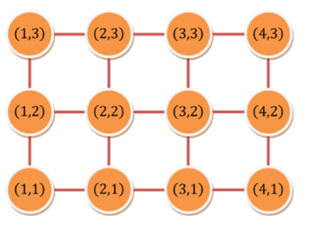
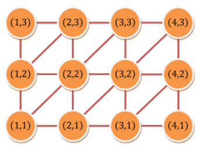

TIL0524

## 1. 오늘 배운것

### 알고리즘


알고리즘 하루 한 문제

## 2. 문제 풀이

SWEA(3349) 최솟값으로 이동하기

한국의 모든 구획이 새롭게 재편성되었다.

정확히 말하면 W개의 남북방향 도로와 H개의 동서방향 도로가 모두 일정한 간격으로 늘어서서 교차하는 바둑판 모양으로 만들었다.

남북방향 도로는 가장 서쪽에 있는 것으로부터 시작해서 동쪽으로 가면서 차례대로 1, 2, …, W로 번호가 매겨져 있고,

동서방향 도로는 가장 남쪽에 있는 것으로부터 시작해서 북쪽으로 가면서 차례대로 1, 2, …, H로 번호가 매겨져 있다.

i번 남북방향 도로와 j번 동서방향 도로가 교차하는 지점을 (i, j)로 나타낸다.

이렇게 도로를 만들고 나면 아래와 같은 모양이 된다.

W = 4, H = 3인 예이다.




정부는 이런 식으로 도로를 만들면 중간에 사용하지 않는 공간이 너무 많은 것 같아서 북동방향으로 가는 도로도 만들었다.

즉 (i, j)와 (i - 1, j - 1)을 연결하는 도로이다.

이런 도로를 만든 다음에는 아래와 같아질 것이다.




준환이는 최근에 일이 많아서 N개의 교차로를 순서대로 이동해야 한다. 

i번째로 이동하려는 지점은 (xi, yi)이다.

정부에서는 교차로에서 다른 교차로로 한번 이동할 때 1만큼의 비용을 내도록 정책을 세웠기 때문에 비용을 줄이기 위해 적절한 전략을 세워야 한다.

준환이는 (x1, y1)에서 시작하여 i가 증가하는 순서대로 (xi, yi)들을 차례대로 방문하고 (xN, yN)에 도착하기 위해 드는 비용의 최솟값이 무엇인지 궁금하다.

이를 구하는 프로그램을 작성하라.

``````python
for tc in range(1, int(input())+1):
    W, H, N = map(int, input().split())
    site = []
    for _ in range(N):
        site.append(tuple(map(int, input().split())))

    res = 0
    for i in range(N-1):
        # 출발지점의 좌표와 도착지점의 좌표를 설정한다.
        x, y = site[i][0], site[i][1]
        nx, ny = site[i+1][0], site[i+1][1]
        # 각 경우의수를 생각하여 절댓값으로 거리를 산출한다.
        if x == nx:
            res += abs(y - ny)
        elif y == ny:
            res += abs(x - nx)
        # 대각선의 방향이 이동방향과 다를경우는 둘다 더해준다.
        elif (x < nx and y > ny) or (x > nx and y < ny):
            res += abs(x - nx) + abs(y - ny)
        else:
            # 대각선의 방향이 이동방향과 같을경우 최댓값만 구해준다.
            res += max(abs(x - nx), abs(y - ny))
            
    print('#{} {}'.format(tc, res))
``````


처음에는 BFS로 풀어보려고 했으나 시간초과로 인해 해결하지 못했다. 단순히 거리의 총 합만 구하면 되는 것이므로 수학적인 계산을 이용하여 풀었더니 처리시간이 비약적으로 줄게 되었다. 단순히 BFS를 이용하는것만이 최선의 답은 아니라는 것을 알게 되었다.