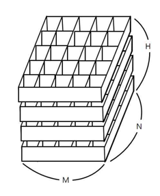

TIL0609

## 1. 오늘 배운것

### 알고리즘


알고리즘 하루 한 문제

## 2. 문제 풀이

BOJ(7569) 토마토

철수의 토마토 농장에서는 토마토를 보관하는 큰 창고를 가지고 있다. 토마토는 아래의 그림과 같이 격자모양 상자의 칸에 하나씩 넣은 다음, 상자들을 수직으로 쌓아 올려서 창고에 보관한다.



창고에 보관되는 토마토들 중에는 잘 익은 것도 있지만, 아직 익지 않은 토마토들도 있을 수 있다. 보관 후 하루가 지나면, 익은 토마토들의 인접한 곳에 있는 익지 않은 토마토들은 익은 토마토의 영향을 받아 익게 된다. 하나의 토마토에 인접한 곳은 위, 아래, 왼쪽, 오른쪽, 앞, 뒤 여섯 방향에 있는 토마토를 의미한다. 대각선 방향에 있는 토마토들에게는 영향을 주지 못하며, 토마토가 혼자 저절로 익는 경우는 없다고 가정한다. 철수는 창고에 보관된 토마토들이 며칠이 지나면 다 익게 되는지 그 최소 일수를 알고 싶어 한다.

토마토를 창고에 보관하는 격자모양의 상자들의 크기와 익은 토마토들과 익지 않은 토마토들의 정보가 주어졌을 때, 며칠이 지나면 토마토들이 모두 익는지, 그 최소 일수를 구하는 프로그램을 작성하라. 단, 상자의 일부 칸에는 토마토가 들어있지 않을 수도 있다.

``````python
from collections import deque

# bfs알고리즘을 이용하여 풀어보았다.
def bfs():
    max_cnt = 0
    Q = deque()
    for i in range(H):
        for j in range(N):
            for k in range(M):
                # 익은 토마토를 Q안에 삽입했다.
                if arr[i][j][k] == 1:
                    Q.append((i, j, k))
    while len(Q) != 0:
        tx, ty, tz = Q.popleft()
        for i in range(6):
            dx = tx + dire[i][0]
            dy = ty + dire[i][1]
            dz = tz + dire[i][2]
       		# 상자의 범위 안쪽이라면,
            if 0 <= dx < H and 0 <= dy < N and 0 <= dz < M:
                # 상자가 익지않은 토마토라면 bfs 실행
                if arr[dx][dy][dz] == 0:
                    Q.append((dx, dy, dz))
                    arr[dx][dy][dz] = arr[tx][ty][tz] + 1
    for i in range(H):
        for j in range(N):
            for k in range(M):
                # 제일 오래걸리는 토마토를 찾았다.
                if arr[i][j][k] > max_cnt:
                    max_cnt = arr[i][j][k]
                # 익지 않은 토마토가 있다면, -1 반환
                elif arr[i][j][k] == 0:
                    return -1
    # 숙성하는데 제일 오래걸리는 토마토의 일수를 반환(첫 토마토를 1로 시작하므로 -1해준다.)
    return max_cnt - 1


M, N, H = map(int, input().split())
arr = [[list(map(int, input().split())) for _ in range(N)] for _ in range(H)]
dire = [[1, 0, 0], [-1, 0, 0], [0, 1, 0], [0, 0, 1], [0, -1, 0], [0, 0, -1]]
result = bfs()
print(result)

print(arr)
``````

