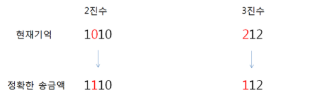

TIL0618

## 1. 오늘 배운것

### 알고리즘


알고리즘 하루 한 문제

## 2. 문제 풀이

SWEA(4366) 정식이의 은행업무

삼성은행의 신입사원 정식이는 실수를 저질렀다.

은행 업무가 마감되기 직전인 지금, 송금할 금액을 까먹고 말았다.

하지만 다행스럽게도 정식이는 평소 금액을 2진수와 3진수의 두 가지 형태로 기억하고 다니며, 기억이 명확하지 않은 지금조차 2진수와 3진수 각각의 수에서 단 한 자리만을 잘못 기억하고 있다는 것만은 알고 있다. 

예를 들어 현재 기억이 2진수 1010과 3진수 212을 말해주고 있다면 이는 14의 2진수인 1110와 14의 3진수인 112를 잘못 기억한 것이라고 추측할 수 있다.

정식이는 실수를 바로잡기 위해 당신에게 부탁을 하였다.

정식이가 송금액을 추측하는 프로그램을 만들어주자.

( 단, 2진수와 3진수의 값은 무조건 1자리씩 틀리다.  추측할 수 없는 경우는 주어지지 않는다. )




``````python
def func(bi, tri, idx):
    bi[idx] = 1 - bi[idx]
    num = 0
    for i in range(-1, -len_bi-1, -1):
        num += bi[i] * (2 ** (i * (-1) - 1))

    temp = num
    strr = ''
    while num:
        strr = str(num % 3) + strr
        num //= 3

    bi[idx] = 1 - bi[idx]
    cnt = 0
    if len_tri == len(strr):
        for i in range(len_tri):
            if strr[i] != tri[i]:
                cnt += 1

        if cnt == 1:
            return temp


T = int(input())
for tc in range(1, T+1):
    bi = list(input())
    tri = list(input())
    len_bi = len(bi)
    len_tri = len(tri)
    for i in range(len_bi):
        bi[i] = int(bi[i])

    for i in range(len_bi):
        if func(bi, tri, i):
            res = func(bi, tri, i)
    print('#{} {}'.format(tc, res))
``````

2진수에서 자리마다 수를 바꾼뒤 3진수로 변환하고 기존의 3진수와 1자리만 바뀐건지 비교를 했다. 3진수를 변환했을시 바뀌는 2진수의 수는 다양하므로 2진수로 먼저 기준을잡고 3진수로 변환을 했다.