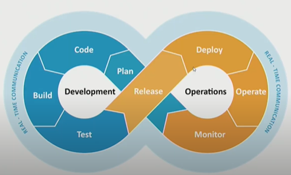

TIL0707

## 1. 오늘 배운것

### Jira

- 개발자와 운영자의 순환 구조인 DevOps에서 핵심적이고 커뮤니케이션에 필요한 것이 `Jira`이다.

- 다른 공간에서 같은 업무의 진행상황 및 해결상황을 공유하며 쉽게 소통할 수 있게 되어있다. 
- `Create` 버튼을 누르면 생성 가능하며 Task, Bug, Epic 타입으로 이슈를 생성 가능하다. 각 이슈마다 담당자, 게시자를 표현할 수 있다.

- status로 각 이슈의 진행 상황을 알 수 있다. to do는 지금 해야하는 것 in progress는 진행중, done은 완료를 나타낸다.
  - Jira 안에서는 Resolution 항목에서 Done인지 Unresolved인지 봐야한다. (status는 마음대로 변경 가능하기 때문에)

- 좌측에 components 항목이 있는데, 여러개의 이슈를 하나의 component에 넣어 관리할 수 있다.

  

### JQL

- Jira Query Language
- Jira Issue를 구조적으로 검색하기위해 제공하는 언어
- SQL(Standard Query Language) 과 비슷한 문법
- Jira의 각 필드들에 맞는 특수한 예약어 제공
- 쌓인 Issue들을 재가공해 유의미한 데이터를 도출해내는데 활용(Gadget, Agile Board 등)
  - 차트나 그래프 등을 통하여 시각적으로 제공

##### JQL Operators

- = , !=, >, >=
- in, not in
- `~`(contains), `!~`(not contains)
- is empty, is not empty, is null, is not null
- currentLogin()
- currentUser()
- 날짜도 가능(주는 w, 일수는 d, 지난날은 음수(-), 미래는 양수)
  - endOfDay(), startOfDay()
  - endOfWeek() (Saturday), startOfWeek() (Sunday)
  - endOfMonth(), startOfMonth(), endOfYear(), startOfYear()

