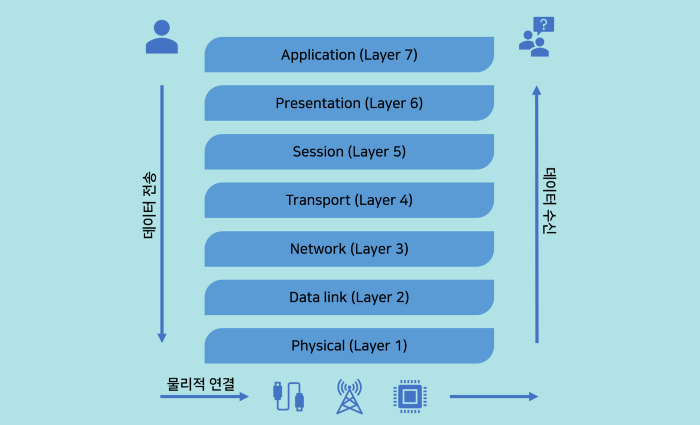

TIL0823

## 1. 오늘 배운것

# OSI 7 Layer

OSI (Open Systems Interconnection) 모형은 네트워크 통신을 저수준에서 고수준까지 일곱 단계로 분류한 것이다. 이 모형은 만질 수 있는 물리적인 장치도 아니고 통신 과정에서 거쳐야 하는 구체적인 단계도 아니다. 복잡할 수 있는 컴퓨터 네트워크를 더 잘 이해하고 소통할 수 있게 돕는 개념적 틀일 뿐이다.

이 틀에서 1 단계부터 4 단계는 저수준 계층으로, 나머지 5 단계부터 7 단계는 고수준 계층으로 나뉜다. 네트워크의 기본 원리는 간단하다 : 데이터를 받아서 가야 할 곳으로 전달해 주는 것이 관건이다. 이 데이터 전달을 저수준일수록 하드웨어적, 전기적, 기계적 관점에서 다루고, 고수준일수록 응용 프로그램과 최종 사용자 영역에서 설명한다. 이를 도표로 시각화하면 다음과 같다.

1. 물리적 계층
   제 1 계층에서는 물리적으로 전류나 광신호, 라디오 신호를 통해 비트 단위의 데이터 전달이 이루어진다.
2. 데이터 링크 계층
   제 2 계층에서는 물리적 계층인 제 1 계층에서 발생한 오류를 바로잡으며, 연결망 내의 컴퓨터가 데이터에 접근하고 전달할 권한을 가지도록 MAC (Media Access Control) 주소를 부여한다.
3. 네트워크 계층
   제 3 계층에서는 연결망 내의 교점 간에 라우팅과 포워딩이 이뤄질 수 있도록 가상 서킷이라는 것을 이용해 논리적 경로를 구축한다.
4. 전송 계층
   제 4 계층은 망의 한 끝에서 다른 끝까지, 네트워크 호스트 간의 완전한 정보 전송을 보장하는 단계이다.
5. 세션 계층
   제 5 계층은 양 끝단의 응용 프로그램이 서로 연결을 맺고 제어할 수 있도록 해 준다.
6. 표현 계층
   제 6 계층은 인코딩, 암호화, 압축 등을 통해 제 7 계층인 응용 계층이 수용할 수 있는 형태로 데이터를 전환하여 호환성 문제를 방지한다.
7. 응용 계층
   제 7 계층은 개별 응용 프로세스에 맞춰 서비스 품질 점검, 사용자 인증, 개인 정보 보호, 자원 공유, 파일 원격 접속 등의 고수준 기능을 지원한다.