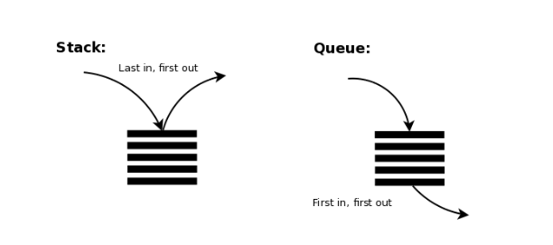

TIL0826

## 1. 오늘 배운것

# Stack, Queue

## 1. Stack

 **스택**(stack)은 제한적으로 접근할 수 있는 나열 구조이다. 그 접근 방법은 언제나 목록의 끝에서만 일어난다. 끝먼저내기 목록(Pushdown list)이라고도 한다.

 스택은 한 쪽 끝에서만 자료를 넣거나 뺄 수 있는 선형 구조(LIFO - Last In First Out)으로 되어 있다. 자료를 넣는 것을 '밀어넣는다' 하여 **푸쉬**(push)라고 하고 반대로 넣어둔 자료를 꺼내는 것을 **팝**(pop)이라고 하는데, 이때 꺼내지는 자료는 가장 최근에 푸쉬한 자료부터 나오게 된다. 이처럼 나중에 넣은 값이 먼저 나오는 것을 LIFO(후입선출) 구조라고 한다.

 따라서 스택은 시간 순서에 따라 자료가 쌓여서 **가장 마지막에 삽입된 자료가 가장 먼저 삭제된다**는

구조적 특징을 가지게 된다. 그리고 비어있는 스택에서 원소를 추출하려고 할 때 stack underflow라고 하며, 스택이 넘치는 경우 stack overflow라고 한다.

 

### 예시

스택의 특징인 후입선출(LIFO)을 활용하여 여러 분야에서 활용 가능하다.

- 웹 브라우저 방문기록 (뒤로 가기) : 가장 나중에 열린 페이지부터 다시 보여준다.
- 역순 문자열 만들기 : 가장 나중에 입력된 문자부터 출력한다.
- 실행 취소 (undo) : 가장 나중에 실행된 것부터 실행을 취소한다.
- 후위 표기법 계산
- DFS (깊이 우선 탐색) 알고리즘

## 2. Queue

 **큐**(queue)는 컴퓨터의 기본적인 자료 구조의 한가지로, 먼저 집어 넣은 데이터가 먼저 나오는 FIFO (First In First Out, 선입선출)구조로 저장하는 형식을 말한다. 영어 단어 queue는 표를 사러 일렬로 늘어선 사람들로 이루어진 줄을 말하기도 하며, 먼저 줄을 선 사람이 먼저 나갈 수 있는 상황을 연상하면 된다. 나중에 집어 넣은 데이터가 먼저 나오는 스택과는 반대되는 개념이다.

정해진 한 곳(top)을 통해서 삽입, 삭제가 이루어지는 스택과는 달리 큐는 한쪽 끝에서 삽입 작업이, 다른 쪽 끝에서 삭제 작업이 양쪽으로 이루어진다. 이때 삭제연산만 수행되는 곳을 프론트(front)**, **삽입연산만 이루어지는 곳을 리어(rear)로 정하여 각각의 연산작업만 수행된다. 이때, 큐의 리어에서 이루어지는 삽입연산을 인큐(enQueue) 프론트에서 이루어지는 삭제연산을 디큐(dnQueue)라고 부른다.

 

### 예시 

큐는 주로 데이터가 입력된 시간 순서대로 처리해야 할 필요가 있는 상황에 이용한다.

- 우선순위가 같은 작업 예약 (프린터의 인쇄 대기열)
- 은행 업무
- 프로세스 관리
- BFS (너비 우선 탐색) 알고리즘